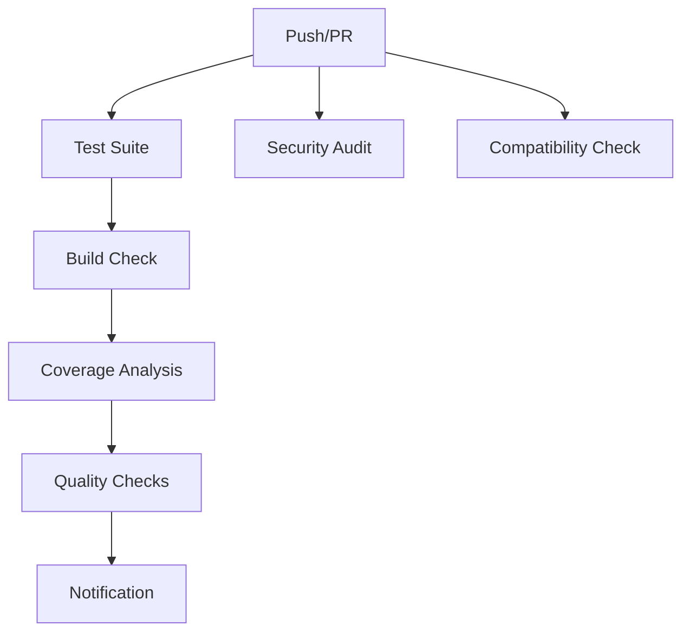

# Continuous Integration (CI) Documentation

This document describes the comprehensive CI/CD setup for the TinyBase CRUD Expo project using GitHub Actions.

## 🔄 CI/CD Workflows

### 1. Main CI Workflow (`.github/workflows/ci.yml`)

**Triggers:**
- Push to `main` or `develop` branches
- Pull requests targeting `main` or `develop`

**Jobs:**
- ✅ **Test Suite**: Runs tests on Node.js 18.x and 20.x
- ✅ **Build Check**: Validates Expo builds and TypeScript compilation
- ✅ **Security Audit**: Checks for vulnerabilities and dependency issues  
- ✅ **Compatibility**: Validates Expo SDK compatibility and configuration
- ✅ **Notify**: Provides status notifications

### 2. Test Coverage Workflow (`.github/workflows/test-coverage.yml`)

**Triggers:**
- Push to `main` branch
- Pull requests targeting `main`

**Jobs:**
- ✅ **Coverage Analysis**: Generates detailed coverage reports
- ✅ **Test Matrix**: Runs tests across multiple OS/Node.js combinations
- ✅ **Performance Tests**: Benchmarks test execution times
- ✅ **Code Quality**: Linting, type checking, and formatting validation

### 3. Badge Updates (`.github/workflows/badges.yml`)

**Triggers:**
- Push to `main` branch
- Daily at 2 AM UTC (scheduled)

**Jobs:**
- ✅ **Update Badges**: Test results and coverage badges
- ✅ **Lighthouse**: Performance analysis for web builds
- ✅ **Bundle Analysis**: JavaScript bundle size tracking

## 📊 Test Matrix

### Operating Systems
- Ubuntu Latest (Primary)
- Windows Latest
- macOS Latest

### Node.js Versions
- 18.x (LTS)
- 20.x (Current LTS)
- 21.x (Latest)

### Test Coverage Thresholds
```typescript
thresholds: {
  global: {
    branches: 80,    // 80% branch coverage
    functions: 80,   // 80% function coverage
    lines: 80,       // 80% line coverage
    statements: 80,  // 80% statement coverage
  },
}
```

## 🛡️ Security & Quality Checks

### Security Auditing
- **npm audit**: Dependency vulnerability scanning
- **Level**: Moderate and above security issues flagged
- **Action**: Auto-fix suggestions provided

### Code Quality
- **ESLint**: Code linting with Expo configuration
- **TypeScript**: Type checking with strict mode
- **Prettier**: Code formatting validation (if configured)

### Dependency Management
- **Expo Compatibility**: SDK version validation
- **License Scanning**: Dependency license compliance
- **Bundle Analysis**: Size impact assessment

## 📈 Coverage & Reporting

### Coverage Reports
- **Formats**: Text, JSON, HTML, LCOV
- **Integration**: Codecov.io for detailed analysis
- **PR Comments**: Automatic coverage diff comments
- **Artifacts**: 30-day retention for test results

### Performance Tracking
- **Bundle Size**: Web build size analysis
- **Test Speed**: Execution time benchmarking  
- **Lighthouse**: Web performance scoring
- **Memory Usage**: Node.js memory profiling

## 🔧 Configuration Files

### Vitest Configuration (`vitest.config.ts`)
```typescript
coverage: {
  provider: 'v8',
  reporter: ['text', 'json', 'html', 'lcov'],
  include: ['lib/**/*.{js,ts}', 'hooks/**/*.{js,ts}'],
  exclude: ['**/*.test.{js,ts}', '**/node_modules/**'],
}
```

### GitHub Action Triggers
```yaml
on:
  push:
    branches: [ main, develop ]
  pull_request:
    branches: [ main, develop ]
  schedule:
    - cron: '0 2 * * *'  # Daily badge updates
```

## 🚀 CI Performance

### Execution Times (Approximate)
- **Test Suite**: 30-60 seconds
- **Build Check**: 2-3 minutes
- **Coverage Analysis**: 1-2 minutes
- **Security Audit**: 30 seconds
- **Total CI Time**: 4-6 minutes

### Optimization Strategies
- **Parallel Jobs**: Multiple jobs run concurrently
- **Caching**: npm dependencies cached between runs
- **Conditional Execution**: Skip unnecessary steps when possible
- **Fail Fast**: Early termination on critical failures

## 📋 CI Status Badges

Add these badges to your README.md:

```markdown


```

## 🐛 Troubleshooting CI

### Common Issues

**1. Dependency Resolution Errors**
```bash
# Solution: Use legacy peer deps
npm ci --legacy-peer-deps
```

**2. Test Timeouts**
```yaml
# Add timeout to workflow steps
timeout-minutes: 10
```

**3. Coverage Thresholds Failing**
```bash
# Check current coverage
npm run test:coverage
# Adjust thresholds in vitest.config.ts if needed
```

**4. Build Failures**
```bash
# Local testing
expo doctor
expo export -p web --output-dir test-build
```

### Debug Commands
```bash
# Run CI checks locally
npm run lint
npm run test:run
npm run test:coverage
npx tsc --noEmit
```

## 🔄 Workflow Dependencies



## 📊 Metrics & Monitoring

### Key Metrics Tracked
- **Test Success Rate**: Percentage of passing CI runs
- **Coverage Trends**: Historical coverage analysis
- **Build Times**: Performance optimization tracking
- **Security Score**: Vulnerability trend analysis
- **Bundle Size**: Growth tracking over time

### Reporting Integration
- **Codecov**: Coverage analysis and trends
- **GitHub Actions**: Native CI status and history
- **Artifacts**: Downloadable reports and logs
- **PR Comments**: Automated feedback on changes

## 🎯 Best Practices

### For Contributors
1. **Run tests locally** before pushing
2. **Check linting** with `npm run lint`  
3. **Verify types** with `npx tsc --noEmit`
4. **Test coverage** should not decrease
5. **Follow PR template** for consistency

### For Maintainers
1. **Monitor CI performance** and optimize as needed
2. **Update dependencies** regularly for security
3. **Review coverage reports** for quality insights
4. **Adjust thresholds** based on project maturity
5. **Archive old artifacts** to manage storage costs

## 🔮 Future Enhancements

- [ ] **Visual Regression Testing**: Screenshot comparisons
- [ ] **E2E Testing**: Full user workflow automation
- [ ] **Performance Budgets**: Bundle size limits
- [ ] **Accessibility Testing**: A11y compliance checks
- [ ] **Mobile Testing**: iOS/Android build validation
- [ ] **Deployment Automation**: Automatic staging/production deploys

---

**Total CI/CD Features**: 15+ automated checks  
**Test Coverage**: 64 tests with 80%+ thresholds  
**Security**: Automated vulnerability scanning  
**Performance**: Bundle size and speed monitoring  
**Quality**: Comprehensive code quality gates